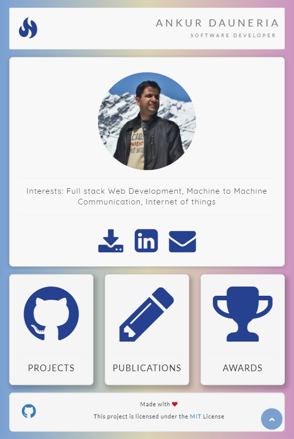
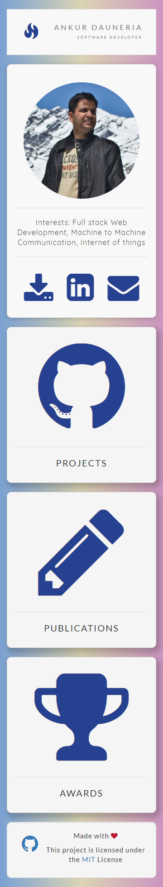

# <p align=center>Portfolio Website</p>

> Portfolio website is a small fully responsive frontend project. It serves a purpose of an online CV showcasing works of an individual to its potential audience.

> Its a work in progress!

## Preview


> Apple iPad version and Nexus 5 mobile version

<p>
  <span></span>
  <span></span>
</p>

## Getting started


Perform following steps to start:

```
git clone <git repository link>
cd <git repository folder>
```

Click on `index.html` available in the root directory to open the portfolio website in a broswer of your choice (Google Chrome, Mozilla Firefox, Microsoft Internet explorer)

## Project structure


* `css` folder contains all the CSS (Cascading Stylesheets) files.

* `js` folder contains all the javascript files.

* `fonts` folder contains fonts related files.

* `img` folder contains all the images.

* `files` folder contains all the downloadbable files

* `less` and `scss` files are related to font-awesome

## Validation checks


* [HTML Validator](http://validator.w3.org/#validate_by_input)
* [CSS Validator](https://jigsaw.w3.org/css-validator/#validate_by_input)

## Built with


* [HTML5](https://developer.mozilla.org/en-US/docs/Web/Guide/HTML/HTML5 "HTML5")
* [CSS3](https://developer.mozilla.org/en/docs/Web/CSS/CSS3 "CSS3")
* Javascript
* Web framework: [Bootstrap 3](https://getbootstrap.com/docs/3.3/ "Bootstrap 3")
* Fonts: [Font Awesome](http://fontawesome.io/ "Font Awesome"), [Social icons](https://lipis.github.io/bootstrap-social/ "Social Icons"), [Google fonts](https://fonts.google.com/ "Google Fonts")
* Color gradient: [uiGradients](https://uigradients.com/ "uiGradients")
* Screen shots: Browser screen shots taken using [Full Page Screen Capture Chrome Extension](http://mrcoles.com/full-page-screen-capture-chrome-extension/ "Full Page Screen Capture")

## Found bug/New feature?


Please report it via issues.

## References


1. [W3 Schools](https://www.w3schools.com/)
2. [Bootstrap 3](http://getbootstrap.com/)

## License


This project is licensed under the MIT License - see the [LICENSE.md](LICENSE.md) file for details.